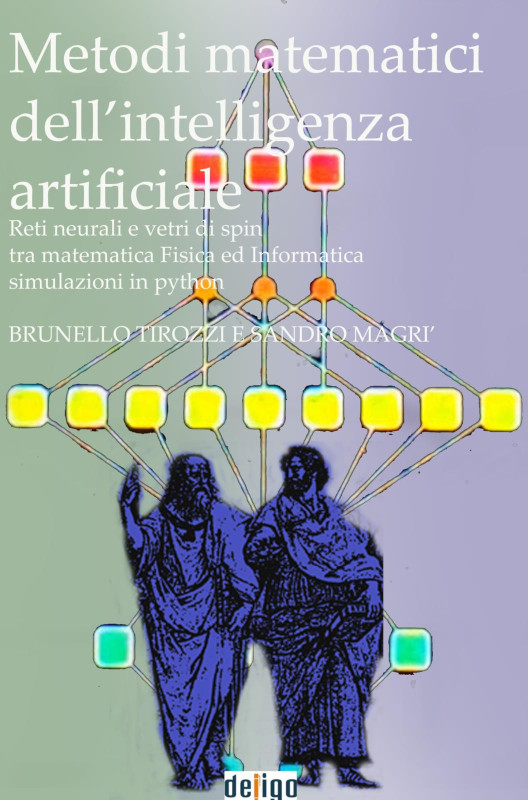

# MMIA-Lab
Laboratorio Didattico per il libro

* Mathematical Methods of Artificial Intelligence  (edizione internazionale in inglese)
* Metodi Matematici dell'Intelligenza Artificiale  (edizione italiana)

Autori:

Brunello Tirozzi, Camillo Tassi, Sandro Magrì

Per informazioni scrivere a sandro@freenetst.it od a s.magri@quantumsym.com

